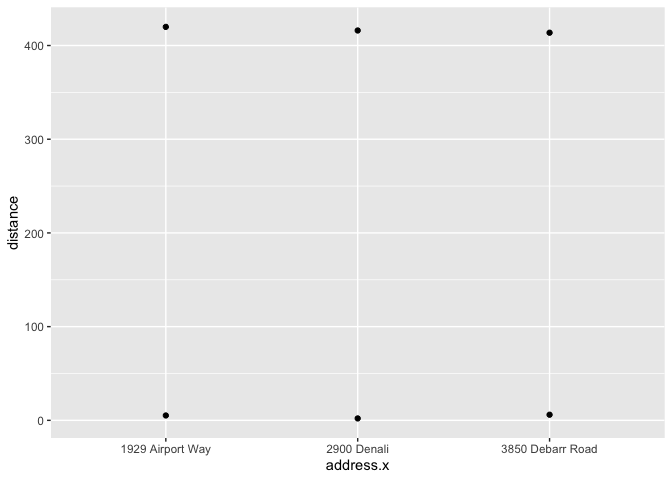
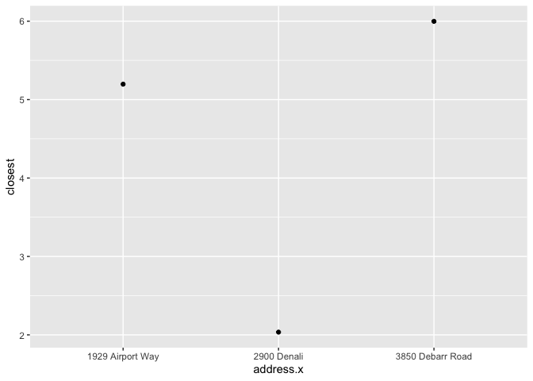
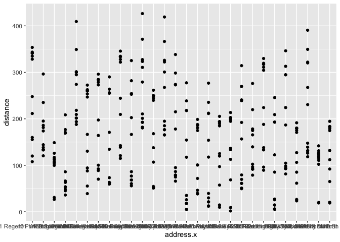
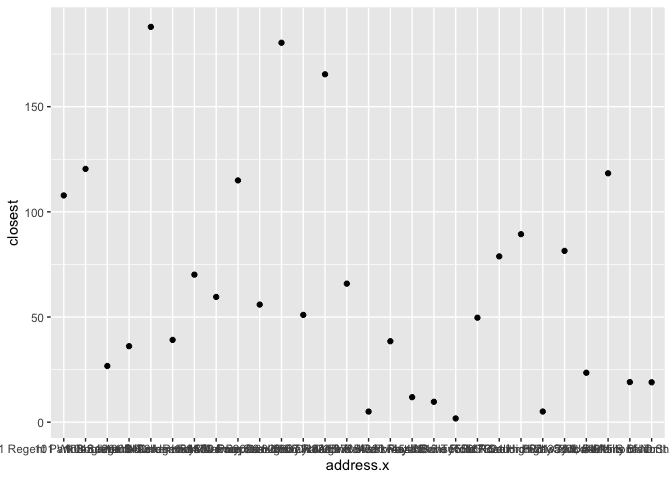
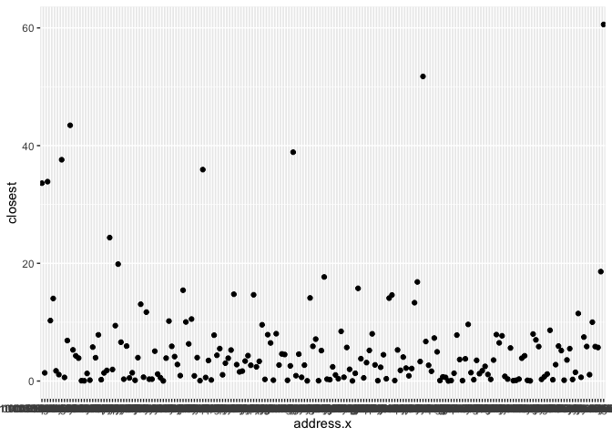
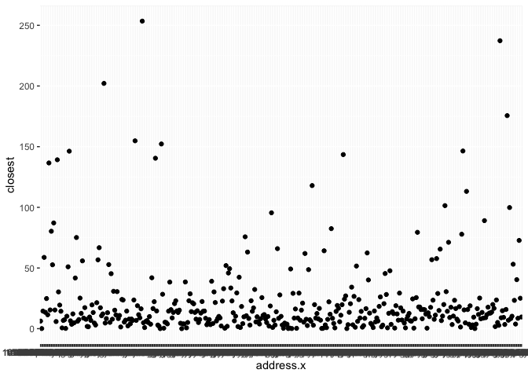

Lab 05 - La Quinta is Spanish for next to Denny’s, Pt. 2
================
Lindsay Stall
2/7/2023

### Load packages and data

``` r
library(tidyverse) 
library(dsbox) 
```

``` r
# install.packages("devtools")
devtools::install_github("rstudio-education/dsbox")
```

    ## Skipping install of 'dsbox' from a github remote, the SHA1 (8fd2a47f) has not changed since last install.
    ##   Use `force = TRUE` to force installation

``` r
states <- read_csv("data/states.csv")
```

``` r
view(dennys)
```

``` r
view(laquinta)
```

### Exercise 1

``` r
dn_ak <- dennys %>%
  filter(state == "AK")
nrow(dn_ak)
```

    ## [1] 3

There are 3 Denny’s locations in Alaska

### Exercise 2

``` r
lq_ak <- laquinta %>%
  filter(state == "AK")
nrow(lq_ak)
```

    ## [1] 2

There are 2 La Quinta locations in Alaska

### Exercise 3

``` r
dn_lq_ak <- full_join(dn_ak, lq_ak, by = "state")
dn_lq_ak
```

    ## # A tibble: 6 × 11
    ##   address.x      city.x state zip.x longi…¹ latit…² addre…³ city.y zip.y longi…⁴
    ##   <chr>          <chr>  <chr> <chr>   <dbl>   <dbl> <chr>   <chr>  <chr>   <dbl>
    ## 1 2900 Denali    Ancho… AK    99503   -150.    61.2 3501 M… "\nAn… 99503   -150.
    ## 2 2900 Denali    Ancho… AK    99503   -150.    61.2 4920 D… "\nFa… 99709   -148.
    ## 3 3850 Debarr R… Ancho… AK    99508   -150.    61.2 3501 M… "\nAn… 99503   -150.
    ## 4 3850 Debarr R… Ancho… AK    99508   -150.    61.2 4920 D… "\nFa… 99709   -148.
    ## 5 1929 Airport … Fairb… AK    99701   -148.    64.8 3501 M… "\nAn… 99503   -150.
    ## 6 1929 Airport … Fairb… AK    99701   -148.    64.8 4920 D… "\nFa… 99709   -148.
    ## # … with 1 more variable: latitude.y <dbl>, and abbreviated variable names
    ## #   ¹​longitude.x, ²​latitude.x, ³​address.y, ⁴​longitude.y

### Exercise 4

There are 6 observations and the variables are address, city, zip,
longitude, and latitude (of both x and y seperately) and state.

### Exercise 5

``` r
haversine <- function(long1, lat1, long2, lat2, round = 3) {
  # convert to radians
  long1 = long1 * pi / 180
  lat1  = lat1  * pi / 180
  long2 = long2 * pi / 180
  lat2  = lat2  * pi / 180
  
  R = 6371 # Earth mean radius in km
  
  a = sin((lat2 - lat1)/2)^2 + cos(lat1) * cos(lat2) * sin((long2 - long1)/2)^2
  d = R * 2 * asin(sqrt(a))
  
  return( round(d,round) ) # distance in km
}
```

### Exercise 6

``` r
dn_lq_ak <- dn_lq_ak %>%
  mutate(dn_lq_ak, distance = haversine(longitude.x, latitude.x, longitude.y, latitude.y, round = 3))
dn_lq_ak
```

    ## # A tibble: 6 × 12
    ##   address.x      city.x state zip.x longi…¹ latit…² addre…³ city.y zip.y longi…⁴
    ##   <chr>          <chr>  <chr> <chr>   <dbl>   <dbl> <chr>   <chr>  <chr>   <dbl>
    ## 1 2900 Denali    Ancho… AK    99503   -150.    61.2 3501 M… "\nAn… 99503   -150.
    ## 2 2900 Denali    Ancho… AK    99503   -150.    61.2 4920 D… "\nFa… 99709   -148.
    ## 3 3850 Debarr R… Ancho… AK    99508   -150.    61.2 3501 M… "\nAn… 99503   -150.
    ## 4 3850 Debarr R… Ancho… AK    99508   -150.    61.2 4920 D… "\nFa… 99709   -148.
    ## 5 1929 Airport … Fairb… AK    99701   -148.    64.8 3501 M… "\nAn… 99503   -150.
    ## 6 1929 Airport … Fairb… AK    99701   -148.    64.8 4920 D… "\nFa… 99709   -148.
    ## # … with 2 more variables: latitude.y <dbl>, distance <dbl>, and abbreviated
    ## #   variable names ¹​longitude.x, ²​latitude.x, ³​address.y, ⁴​longitude.y

### Exercise 7

``` r
dn_lq_ak_mindist <- dn_lq_ak %>%
  group_by(address.x) %>%
  summarize(closest = min(distance))
dn_lq_ak_mindist
```

    ## # A tibble: 3 × 2
    ##   address.x        closest
    ##   <chr>              <dbl>
    ## 1 1929 Airport Way    5.20
    ## 2 2900 Denali         2.04
    ## 3 3850 Debarr Road    6.00

### Exercise 8

``` r
dn_lq_ak%>%
  ggplot(mapping = aes(x=address.x, y=distance)) + geom_point()
```

<!-- -->

``` r
dn_lq_ak_mindist %>%
  ggplot(mapping = aes(x=address.x, y=closest)) + geom_point()
```

<!-- -->

### Exercise 9

``` r
dn_nc <- dennys %>%
  filter(state == "NC")
nrow(dn_nc)
```

    ## [1] 28

``` r
lq_nc <- laquinta %>%
  filter(state == "NC")
nrow(lq_nc)
```

    ## [1] 12

``` r
dn_lq_nc <- full_join(dn_nc, lq_nc, by = "state")
dn_lq_nc
```

    ## # A tibble: 336 × 11
    ##    address.x     city.x state zip.x longi…¹ latit…² addre…³ city.y zip.y longi…⁴
    ##    <chr>         <chr>  <chr> <chr>   <dbl>   <dbl> <chr>   <chr>  <chr>   <dbl>
    ##  1 1 Regent Par… Ashev… NC    28806   -82.6    35.6 165 Hw… "\nBo… 28607   -81.7
    ##  2 1 Regent Par… Ashev… NC    28806   -82.6    35.6 3127 S… "\nCh… 28208   -80.9
    ##  3 1 Regent Par… Ashev… NC    28806   -82.6    35.6 4900 S… "\nCh… 28217   -80.9
    ##  4 1 Regent Par… Ashev… NC    28806   -82.6    35.6 4414 D… "\nDu… 27707   -79.0
    ##  5 1 Regent Par… Ashev… NC    28806   -82.6    35.6 1910 W… "\nDu… 27713   -78.9
    ##  6 1 Regent Par… Ashev… NC    28806   -82.6    35.6 1201 L… "\nGr… 27407   -79.9
    ##  7 1 Regent Par… Ashev… NC    28806   -82.6    35.6 1607 F… "\nCo… 28613   -81.3
    ##  8 1 Regent Par… Ashev… NC    28806   -82.6    35.6 191 Cr… "\nCa… 27518   -78.8
    ##  9 1 Regent Par… Ashev… NC    28806   -82.6    35.6 2211 S… "\nRa… 27612   -78.7
    ## 10 1 Regent Par… Ashev… NC    28806   -82.6    35.6 1001 A… "\nMo… 27560   -78.8
    ## # … with 326 more rows, 1 more variable: latitude.y <dbl>, and abbreviated
    ## #   variable names ¹​longitude.x, ²​latitude.x, ³​address.y, ⁴​longitude.y

``` r
dn_lq_nc <- dn_lq_nc %>%
  mutate(dn_lq_nc, distance = haversine(longitude.x, latitude.x, longitude.y, latitude.y, round = 3))
dn_lq_nc
```

    ## # A tibble: 336 × 12
    ##    address.x     city.x state zip.x longi…¹ latit…² addre…³ city.y zip.y longi…⁴
    ##    <chr>         <chr>  <chr> <chr>   <dbl>   <dbl> <chr>   <chr>  <chr>   <dbl>
    ##  1 1 Regent Par… Ashev… NC    28806   -82.6    35.6 165 Hw… "\nBo… 28607   -81.7
    ##  2 1 Regent Par… Ashev… NC    28806   -82.6    35.6 3127 S… "\nCh… 28208   -80.9
    ##  3 1 Regent Par… Ashev… NC    28806   -82.6    35.6 4900 S… "\nCh… 28217   -80.9
    ##  4 1 Regent Par… Ashev… NC    28806   -82.6    35.6 4414 D… "\nDu… 27707   -79.0
    ##  5 1 Regent Par… Ashev… NC    28806   -82.6    35.6 1910 W… "\nDu… 27713   -78.9
    ##  6 1 Regent Par… Ashev… NC    28806   -82.6    35.6 1201 L… "\nGr… 27407   -79.9
    ##  7 1 Regent Par… Ashev… NC    28806   -82.6    35.6 1607 F… "\nCo… 28613   -81.3
    ##  8 1 Regent Par… Ashev… NC    28806   -82.6    35.6 191 Cr… "\nCa… 27518   -78.8
    ##  9 1 Regent Par… Ashev… NC    28806   -82.6    35.6 2211 S… "\nRa… 27612   -78.7
    ## 10 1 Regent Par… Ashev… NC    28806   -82.6    35.6 1001 A… "\nMo… 27560   -78.8
    ## # … with 326 more rows, 2 more variables: latitude.y <dbl>, distance <dbl>, and
    ## #   abbreviated variable names ¹​longitude.x, ²​latitude.x, ³​address.y,
    ## #   ⁴​longitude.y

336 observations, the variables are Address, city, zip, longitude, and
latitude of both x and y and state

``` r
dn_lq_nc_mindist <- dn_lq_nc %>%
  group_by(address.x) %>%
  summarize(closest = min(distance))
dn_lq_nc_mindist
```

    ## # A tibble: 28 × 2
    ##    address.x                 closest
    ##    <chr>                       <dbl>
    ##  1 1 Regent Park Boulevard     108. 
    ##  2 101 Wintergreen Dr          120. 
    ##  3 103 Sedgehill Dr             26.7
    ##  4 1043 Jimmie Kerr Road        36.1
    ##  5 1201 S College Road         188. 
    ##  6 1209 Burkemount Avenue       39.1
    ##  7 1493 Us Hwy 74-A Bypass      70.1
    ##  8 1524 Dabney Dr               59.5
    ##  9 1550 Four Seasons           115. 
    ## 10 1800 Princeton-Kenly Road    55.9
    ## # … with 18 more rows

``` r
dn_lq_nc <- dn_lq_nc %>%
  mutate(dn_lq_nc, distance = haversine(longitude.x, latitude.x, longitude.y, latitude.y, round = 3))
dn_lq_nc
```

    ## # A tibble: 336 × 12
    ##    address.x     city.x state zip.x longi…¹ latit…² addre…³ city.y zip.y longi…⁴
    ##    <chr>         <chr>  <chr> <chr>   <dbl>   <dbl> <chr>   <chr>  <chr>   <dbl>
    ##  1 1 Regent Par… Ashev… NC    28806   -82.6    35.6 165 Hw… "\nBo… 28607   -81.7
    ##  2 1 Regent Par… Ashev… NC    28806   -82.6    35.6 3127 S… "\nCh… 28208   -80.9
    ##  3 1 Regent Par… Ashev… NC    28806   -82.6    35.6 4900 S… "\nCh… 28217   -80.9
    ##  4 1 Regent Par… Ashev… NC    28806   -82.6    35.6 4414 D… "\nDu… 27707   -79.0
    ##  5 1 Regent Par… Ashev… NC    28806   -82.6    35.6 1910 W… "\nDu… 27713   -78.9
    ##  6 1 Regent Par… Ashev… NC    28806   -82.6    35.6 1201 L… "\nGr… 27407   -79.9
    ##  7 1 Regent Par… Ashev… NC    28806   -82.6    35.6 1607 F… "\nCo… 28613   -81.3
    ##  8 1 Regent Par… Ashev… NC    28806   -82.6    35.6 191 Cr… "\nCa… 27518   -78.8
    ##  9 1 Regent Par… Ashev… NC    28806   -82.6    35.6 2211 S… "\nRa… 27612   -78.7
    ## 10 1 Regent Par… Ashev… NC    28806   -82.6    35.6 1001 A… "\nMo… 27560   -78.8
    ## # … with 326 more rows, 2 more variables: latitude.y <dbl>, distance <dbl>, and
    ## #   abbreviated variable names ¹​longitude.x, ²​latitude.x, ³​address.y,
    ## #   ⁴​longitude.y

``` r
dn_lq_nc_mindist <- dn_lq_nc %>%
  group_by(address.x) %>%
  summarize(closest = min(distance))
dn_lq_nc_mindist
```

    ## # A tibble: 28 × 2
    ##    address.x                 closest
    ##    <chr>                       <dbl>
    ##  1 1 Regent Park Boulevard     108. 
    ##  2 101 Wintergreen Dr          120. 
    ##  3 103 Sedgehill Dr             26.7
    ##  4 1043 Jimmie Kerr Road        36.1
    ##  5 1201 S College Road         188. 
    ##  6 1209 Burkemount Avenue       39.1
    ##  7 1493 Us Hwy 74-A Bypass      70.1
    ##  8 1524 Dabney Dr               59.5
    ##  9 1550 Four Seasons           115. 
    ## 10 1800 Princeton-Kenly Road    55.9
    ## # … with 18 more rows

``` r
dn_lq_nc%>%
  ggplot(mapping = aes(x=address.x, y=distance)) + geom_point()
```

<!-- -->

``` r
dn_lq_nc_mindist%>%
  ggplot(mapping = aes(x=address.x, y=closest)) + geom_point()
```

<!-- -->

### Exercise 10

``` r
dn_tx <- dennys %>%
  filter(state == "TX")
nrow(dn_tx)
```

    ## [1] 200

``` r
lq_tx <- laquinta %>%
  filter(state == "TX")
nrow(lq_tx)
```

    ## [1] 237

``` r
dn_lq_tx <- full_join(dn_tx, lq_tx, by = "state")
dn_lq_tx
```

    ## # A tibble: 47,400 × 11
    ##    address.x     city.x state zip.x longi…¹ latit…² addre…³ city.y zip.y longi…⁴
    ##    <chr>         <chr>  <chr> <chr>   <dbl>   <dbl> <chr>   <chr>  <chr>   <dbl>
    ##  1 120 East I-20 Abile… TX    79601   -99.6    32.4 3018 C… "\nAb… 79606   -99.8
    ##  2 120 East I-20 Abile… TX    79601   -99.6    32.4 3501 W… "\nAb… 79601   -99.7
    ##  3 120 East I-20 Abile… TX    79601   -99.6    32.4 14925 … "\nAd… 75254   -96.8
    ##  4 120 East I-20 Abile… TX    79601   -99.6    32.4 909 Ea… "\nAl… 78516   -98.1
    ##  5 120 East I-20 Abile… TX    79601   -99.6    32.4 2400 E… "\nAl… 78332   -98.0
    ##  6 120 East I-20 Abile… TX    79601   -99.6    32.4 1220 N… "\nAl… 75013   -96.7
    ##  7 120 East I-20 Abile… TX    79601   -99.6    32.4 1165 H… "\nAl… 76009   -97.2
    ##  8 120 East I-20 Abile… TX    79601   -99.6    32.4 880 So… "\nAl… 77511   -95.2
    ##  9 120 East I-20 Abile… TX    79601   -99.6    32.4 1708 I… "\nAm… 79103  -102. 
    ## 10 120 East I-20 Abile… TX    79601   -99.6    32.4 9305 E… "\nAm… 79118  -102. 
    ## # … with 47,390 more rows, 1 more variable: latitude.y <dbl>, and abbreviated
    ## #   variable names ¹​longitude.x, ²​latitude.x, ³​address.y, ⁴​longitude.y

47,400 observations, the variables are Address, city, zip, longitude,
and latitude of both x and y (separately) and state

``` r
dn_lq_tx <- dn_lq_tx %>%
  mutate(dn_lq_tx, distance = haversine(longitude.x, latitude.x, longitude.y, latitude.y, round = 3))
dn_lq_tx
```

    ## # A tibble: 47,400 × 12
    ##    address.x     city.x state zip.x longi…¹ latit…² addre…³ city.y zip.y longi…⁴
    ##    <chr>         <chr>  <chr> <chr>   <dbl>   <dbl> <chr>   <chr>  <chr>   <dbl>
    ##  1 120 East I-20 Abile… TX    79601   -99.6    32.4 3018 C… "\nAb… 79606   -99.8
    ##  2 120 East I-20 Abile… TX    79601   -99.6    32.4 3501 W… "\nAb… 79601   -99.7
    ##  3 120 East I-20 Abile… TX    79601   -99.6    32.4 14925 … "\nAd… 75254   -96.8
    ##  4 120 East I-20 Abile… TX    79601   -99.6    32.4 909 Ea… "\nAl… 78516   -98.1
    ##  5 120 East I-20 Abile… TX    79601   -99.6    32.4 2400 E… "\nAl… 78332   -98.0
    ##  6 120 East I-20 Abile… TX    79601   -99.6    32.4 1220 N… "\nAl… 75013   -96.7
    ##  7 120 East I-20 Abile… TX    79601   -99.6    32.4 1165 H… "\nAl… 76009   -97.2
    ##  8 120 East I-20 Abile… TX    79601   -99.6    32.4 880 So… "\nAl… 77511   -95.2
    ##  9 120 East I-20 Abile… TX    79601   -99.6    32.4 1708 I… "\nAm… 79103  -102. 
    ## 10 120 East I-20 Abile… TX    79601   -99.6    32.4 9305 E… "\nAm… 79118  -102. 
    ## # … with 47,390 more rows, 2 more variables: latitude.y <dbl>, distance <dbl>,
    ## #   and abbreviated variable names ¹​longitude.x, ²​latitude.x, ³​address.y,
    ## #   ⁴​longitude.y

``` r
dn_lq_tx_mindist <- dn_lq_tx %>%
  group_by(address.x) %>%
  summarize(closest = min(distance))
dn_lq_tx_mindist
```

    ## # A tibble: 200 × 2
    ##    address.x             closest
    ##    <chr>                   <dbl>
    ##  1 100 Cottonwood         33.6  
    ##  2 100 E Pinehurst         1.39 
    ##  3 100 Us Highway 79 S    33.9  
    ##  4 101 N Fm 707           10.3  
    ##  5 1011 Beltway Parkway   14.0  
    ##  6 1015 Spur 350 West      1.74 
    ##  7 1015 West Main St       1.10 
    ##  8 10367 Highway 59       37.6  
    ##  9 10433 N Central Expwy   0.618
    ## 10 105 W 42nd St           6.88 
    ## # … with 190 more rows

``` r
dn_lq_tx_mindist%>%
  ggplot(mapping = aes(x=address.x, y=closest)) + geom_point()
```

<!-- --> As you can
see here, it does appear as if there is a La Quinta very close to almost
every Dennys, only a handful were farther away.

### Exercise 11

``` r
dn_ca <- dennys %>%
  filter(state == "CA")
nrow(dn_ca)
```

    ## [1] 403

``` r
lq_ca <- laquinta %>%
  filter(state == "CA")
nrow(lq_ca)
```

    ## [1] 56

``` r
dn_lq_ca <- full_join(dn_ca, lq_ca, by = "state")
dn_lq_ca
```

    ## # A tibble: 22,568 × 11
    ##    address.x     city.x state zip.x longi…¹ latit…² addre…³ city.y zip.y longi…⁴
    ##    <chr>         <chr>  <chr> <chr>   <dbl>   <dbl> <chr>   <chr>  <chr>   <dbl>
    ##  1 14240 Us Hig… Adela… CA    92301   -117.    34.5 1752 C… "\nAn… 92802   -118.
    ##  2 14240 Us Hig… Adela… CA    92301   -117.    34.5 8858 S… "\nBa… 93308   -119.
    ##  3 14240 Us Hig… Adela… CA    92301   -117.    34.5 3232 R… "\nBa… 93308   -119.
    ##  4 14240 Us Hig… Adela… CA    92301   -117.    34.5 920 Un… "\nBe… 94710   -122.
    ##  5 14240 Us Hig… Adela… CA    92301   -117.    34.5 3 Cent… "\nLa… 90623   -118.
    ##  6 14240 Us Hig… Adela… CA    92301   -117.    34.5 1771 R… "\nDa… 95618   -122.
    ##  7 14240 Us Hig… Adela… CA    92301   -117.    34.5 6275 D… "\nDu… 94568   -122.
    ##  8 14240 Us Hig… Adela… CA    92301   -117.    34.5 316 Pi… "\nFa… 94534   -122.
    ##  9 14240 Us Hig… Adela… CA    92301   -117.    34.5 190 N.… "\nFo… 93625   -120.
    ## 10 14240 Us Hig… Adela… CA    92301   -117.    34.5 46200 … "\nFr… 94538   -122.
    ## # … with 22,558 more rows, 1 more variable: latitude.y <dbl>, and abbreviated
    ## #   variable names ¹​longitude.x, ²​latitude.x, ³​address.y, ⁴​longitude.y

``` r
dn_lq_ca <- dn_lq_ca %>%
  mutate(dn_lq_ca, distance = haversine(longitude.x, latitude.x, longitude.y, latitude.y, round = 3))
dn_lq_ca
```

    ## # A tibble: 22,568 × 12
    ##    address.x     city.x state zip.x longi…¹ latit…² addre…³ city.y zip.y longi…⁴
    ##    <chr>         <chr>  <chr> <chr>   <dbl>   <dbl> <chr>   <chr>  <chr>   <dbl>
    ##  1 14240 Us Hig… Adela… CA    92301   -117.    34.5 1752 C… "\nAn… 92802   -118.
    ##  2 14240 Us Hig… Adela… CA    92301   -117.    34.5 8858 S… "\nBa… 93308   -119.
    ##  3 14240 Us Hig… Adela… CA    92301   -117.    34.5 3232 R… "\nBa… 93308   -119.
    ##  4 14240 Us Hig… Adela… CA    92301   -117.    34.5 920 Un… "\nBe… 94710   -122.
    ##  5 14240 Us Hig… Adela… CA    92301   -117.    34.5 3 Cent… "\nLa… 90623   -118.
    ##  6 14240 Us Hig… Adela… CA    92301   -117.    34.5 1771 R… "\nDa… 95618   -122.
    ##  7 14240 Us Hig… Adela… CA    92301   -117.    34.5 6275 D… "\nDu… 94568   -122.
    ##  8 14240 Us Hig… Adela… CA    92301   -117.    34.5 316 Pi… "\nFa… 94534   -122.
    ##  9 14240 Us Hig… Adela… CA    92301   -117.    34.5 190 N.… "\nFo… 93625   -120.
    ## 10 14240 Us Hig… Adela… CA    92301   -117.    34.5 46200 … "\nFr… 94538   -122.
    ## # … with 22,558 more rows, 2 more variables: latitude.y <dbl>, distance <dbl>,
    ## #   and abbreviated variable names ¹​longitude.x, ²​latitude.x, ³​address.y,
    ## #   ⁴​longitude.y

``` r
dn_lq_ca_mindist <- dn_lq_ca %>%
  group_by(address.x) %>%
  summarize(closest = min(distance))
dn_lq_ca_mindist
```

    ## # A tibble: 403 × 2
    ##    address.x            closest
    ##    <chr>                  <dbl>
    ##  1 #2 Serra Monte         6.24 
    ##  2 10 Airport Blvd        0.093
    ##  3 1000 Imola Ave        14.5  
    ##  4 1000 W Steele Lane    58.7  
    ##  5 1001 E Capitol        13.5  
    ##  6 1010 W Alameda Ave    24.8  
    ##  7 1011 Riley Street     11.4  
    ##  8 1014 N Main St       137.   
    ##  9 1015 Blossom Hill Rd  15.4  
    ## 10 1019 East Main St     80.3  
    ## # … with 393 more rows

``` r
dn_lq_ca_mindist%>%
  ggplot(mapping = aes(x=address.x, y=closest)) + geom_point()
```

<!-- -->

### Exercise 12

The joke appears most applicable in California
